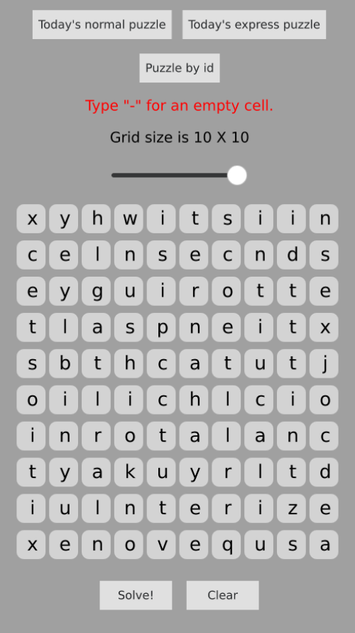
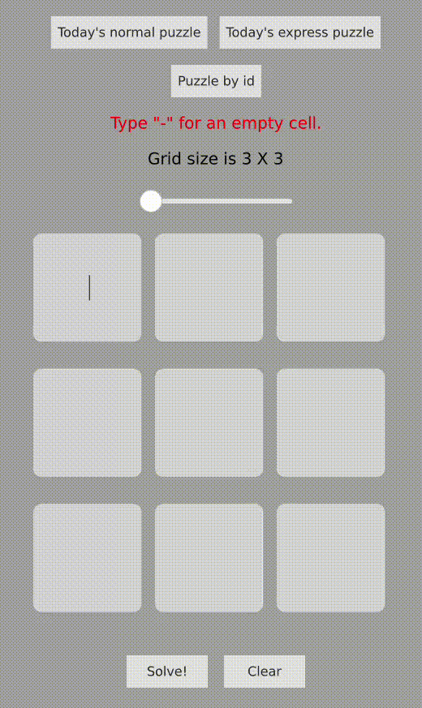
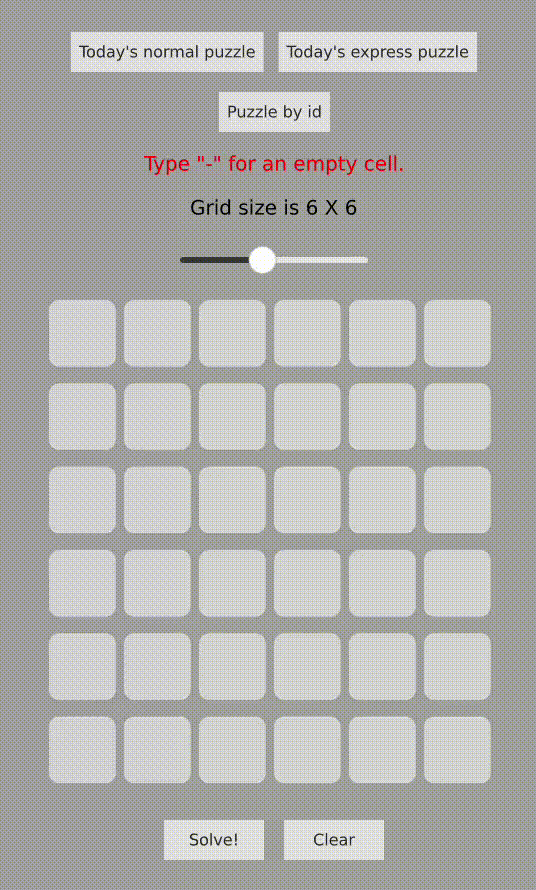
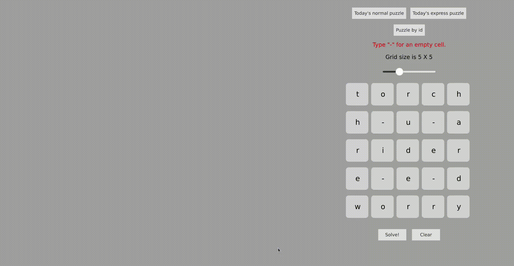
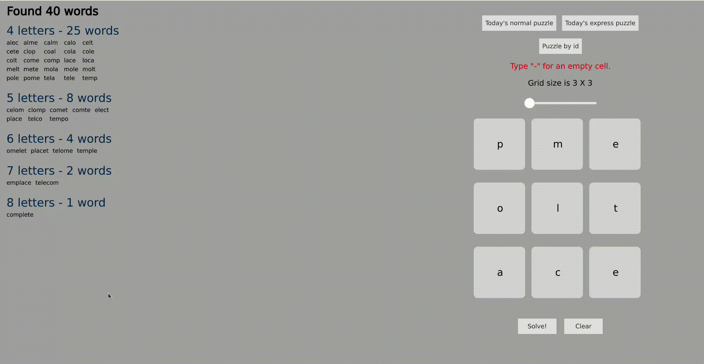

# Squaredle Solver

A fast and easy-to-use solver for the word-finding game [Squaredle](https://squaredle.app/).

Try it [here](https://idanhalp.github.io/Squaredle-Solver/Live/).

Currently, access from mobile is not supported.

## How to use the solver?
1. Insert the input. Currently, several methods are supported: 
	

	
Manually writing into cells

	
	

     
	

	
Importing by puzzle ID by pressing the relevant button above the grid

	
	

         
	

	
Importing the daily normal and express puzzle by pressing their respective buttons above the grid

	
	

2.	

	
Press the 'solve' button, and the list of the words found in the grid will appear

	
	

3.	

	
Click on a word to highlight its squares

	
	

